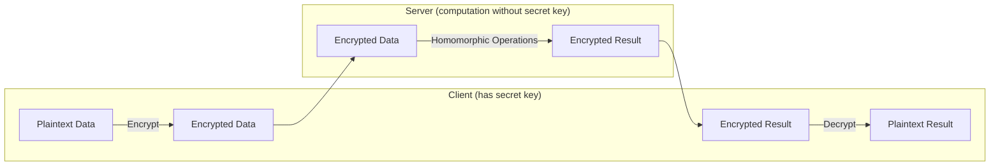
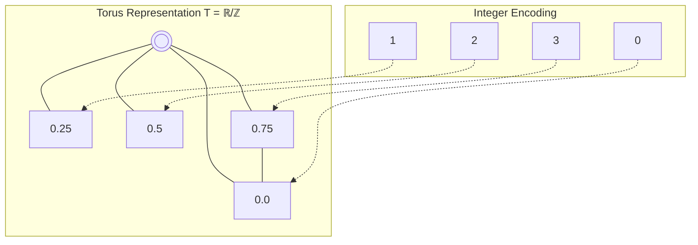
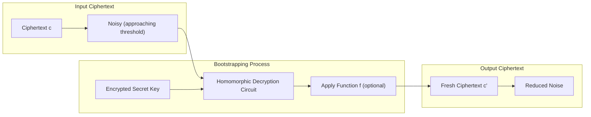
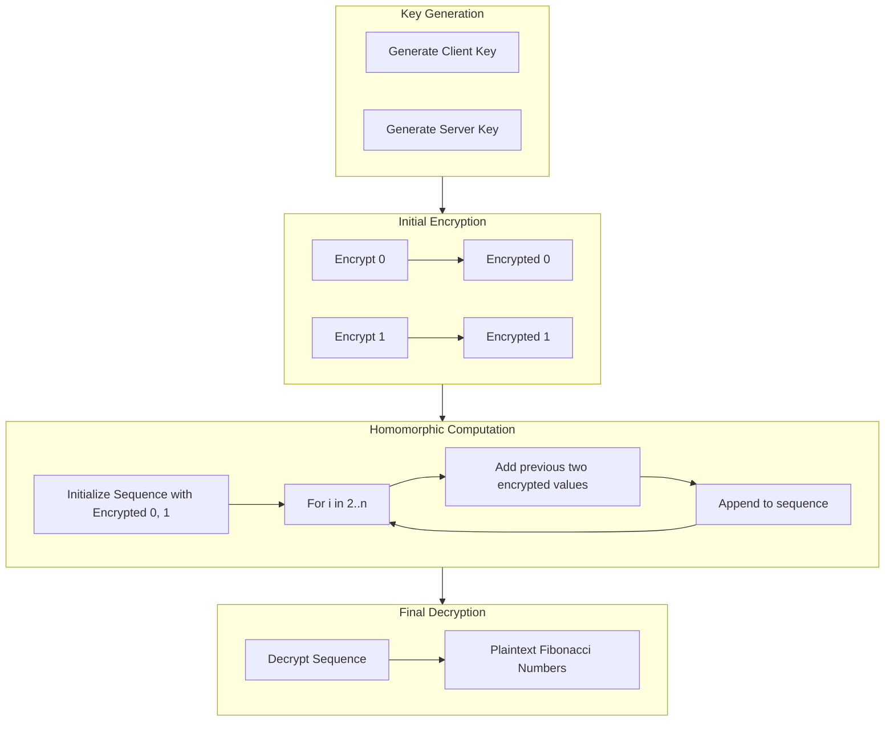

# 🔒 TFHE-rs Examples and Applications


This repository contains examples and applications demonstrating the power of Fully Homomorphic Encryption (FHE) using the [TFHE-rs](https://github.com/zama-ai/tfhe-rs) library. The examples showcase how to perform computations on encrypted data without ever decrypting it.

## ✨ What is Fully Homomorphic Encryption?

Fully Homomorphic Encryption (FHE) is a revolutionary cryptographic technique that allows computations to be performed directly on encrypted data. The results of these computations, when decrypted, match the results of the same operations performed on the original, unencrypted data.



With FHE:
- Data remains encrypted throughout the entire computation process
- The party performing the computation never sees the actual data
- The results are only accessible to those with the decryption key

## 🎬 Demo

https://github.com/user-attachments/assets/01448711-c34e-4667-b087-cd4016560607

This demo showcases:
- 🔑 **Key Generation**: Creating encryption and server keys
- 🔒 **Data Encryption**: Securing initial Fibonacci values (0, 1)
- ⚡ **Homomorphic Computation**: Adding encrypted numbers without decryption
- 📊 **Performance Metrics**: Real-time timing of each operation
- ✅ **Result Verification**: Decrypting to verify correctness

### What You'll See

The video demonstrates the complete FHE workflow:

1. **Docker Environment Setup** - One command to get started (`make cli`)
2. **Interactive CLI** - User-friendly commands (`tfhe-cli fibonacci 10`)
3. **Live Computation** - Watch encrypted additions happen in real-time
4. **Performance Insights** - See the actual time each cryptographic operation takes
5. **Mathematical Verification** - Confirm the encrypted computation produces correct results

## 🚀 Getting Started

### Prerequisites

>[!IMPORTANT]
>Before running these examples, ensure you have the following tools installed:
>- Rust (v1.86.0 or later)
>- Nix package manager (for the development environment)
>- Git (to clone this repository)

### Setup

>[!TIP]
>This repository includes a Nix flake for easy environment setup!

There are multiple ways to set up the development environment:

<details>
<summary><b>Option 1: Using Makefile (Recommended)</b></summary>

1. Clone the repository
   ```bash
   git clone https://github.com/your-username/IC-Quantum-2025.git
   cd IC-Quantum-2025/examples-rs
   ```

2. Start the development environment
   ```bash
   make start
   ```

This will automatically activate the Nix shell with all required dependencies.
</details>

<details>
<summary><b>Option 2: Using Nix directly</b></summary>

1. Clone the repository
   ```bash
   git clone https://github.com/your-username/IC-Quantum-2025.git
   cd IC-Quantum-2025/examples-rs
   ```

2. Enter the Nix shell
   ```bash
   nix develop
   ```
</details>

<details>
<summary><b>Option 3: Manual setup</b></summary>

1. Install Rust (1.86.0 or later)
2. Install the Just command runner
3. Run the project with cargo
   ```bash
   # The project's Cargo.toml already includes all necessary dependencies:
   # - tfhe = { version = "1.1.0", features = ["boolean", "shortint", "integer"] }
   # - anyhow = "1.0"
   # - rand = "0.8"
   
   cargo build --release
   ```
</details>

## 🧮 Understanding the Mathematics Behind TFHE

TFHE (Torus Fully Homomorphic Encryption) is an FHE scheme based on learning with errors (LWE) and its ring variant (RLWE). Let's dive deep into how it works, starting from first principles.

### Fundamental Cryptographic Building Blocks

TFHE builds on several cryptographic primitives:

#### Learning With Errors (LWE)

At its core, TFHE uses the Learning With Errors problem, which is believed to be resistant to quantum computing attacks.

The basic LWE encryption of a message `m` looks like this:

```
c = (a, b = <a,s> + e + m)
```

Where:
- `a` is a random vector
- `s` is the secret key
- `e` is a small error/noise term
- `<a,s>` is the dot product of vectors `a` and `s`

This construction has the remarkable property that:
- Adding two ciphertexts results in the encryption of the sum
- Multiplying by a plaintext constant works directly

#### The Torus Representation

>[!NOTE]
>TFHE uses a mathematical structure called a torus (T = ℝ/ℤ, the real numbers modulo 1) to represent messages.

In practical terms, this means working with fractional values in [0,1) where arithmetical operations wrap around like on a circle. For implementation purposes, these values are discretized using fixed-point arithmetic.

```
T = {x ∈ ℝ | 0 ≤ x < 1}
```



This representation offers two key advantages:
1. It enables efficient implementation of bootstrapping
2. It naturally handles the cyclic behavior required for homomorphic operations

### Encryption and Noise Management

When encrypting in TFHE:

1. **Encoding**: First, the plaintext message is encoded into the torus representation
   ```
   m_encoded = encode(m) ∈ T
   ```

2. **Encryption**: Then, the encoded message is encrypted using LWE
   ```
   c = (a, b = <a,s> + e + m_encoded)
   ```

3. **Noise Growth**: Each homomorphic operation increases noise:
   - Addition: The noise terms add linearly
     ```
     noise(c₁ + c₂) ≈ noise(c₁) + noise(c₂)
     ```
   - Multiplication: Noise grows quadratically
     ```
     noise(c₁ · c₂) ≈ noise(c₁) · noise(c₂)
     ```

Once noise exceeds a certain threshold, the ciphertext can no longer be correctly decrypted.

### Bootstrapping: The Core of TFHE

Bootstrapping is the critical operation that makes TFHE fully homomorphic by allowing an unlimited number of operations.

In technical terms, bootstrapping:
1. Takes a ciphertext with large noise
2. Homomorphically evaluates the decryption function using an encryption of the secret key
3. Produces a fresh ciphertext with the same plaintext but reduced noise

This can be expressed as:
```
bootstrap(c) = Homomorphic-Eval(Dec, Enc(sk), c) = fresh_c
```



TFHE implements this efficiently through:

1. **Key Switching**: Transforms a ciphertext encrypted under one key to encryption under another key
2. **Programmable Bootstrapping**: Allows evaluating arbitrary functions during the bootstrapping process
3. **FFT Acceleration**: Uses the Fast Fourier Transform to speed up polynomial multiplications

### The Programmable Bootstrapping Technique

A key innovation in TFHE is programmable bootstrapping, which:
- Combines bootstrapping with function evaluation
- Allows arbitrary lookup tables to be computed homomorphically
- Enables efficient implementation of non-linear functions

This is achieved by approximating functions with trigonometric polynomials during the bootstrapping operation.

```
PBS(c, f) = Bootstrapped ciphertext encoding f(Dec(c))
```

### Integer Operations in TFHE-rs

TFHE-rs implements integer operations by working with individual bits or small integer chunks:

- For small integers: Direct encoding on the torus
- For larger integers: Decomposition into multiple ciphertexts (bit-slicing or digit-decomposition)

The following operations are implemented efficiently:
- Addition and subtraction (relatively low noise growth)
- Multiplication (implemented via binary decomposition and additions)
- Comparisons (implemented using subtraction and sign extraction)
- Logical operations (implemented via lookup tables)

## 💡 The Fibonacci Example Explained

The Fibonacci example provides an excellent case study for understanding TFHE operations:

### 1. Key Generation
```rust
let config = ConfigBuilder::default().build();
let (client_key, server_key) = generate_keys(config);
```

This creates:
- A secret key for encryption/decryption (client_key)
- A public key for homomorphic operations (server_key)

### 2. Encryption
```rust
let a = FheUint32::try_encrypt(0u32, &self.client_key);
let b = FheUint32::try_encrypt(1u32, &self.client_key);
```

Here we encrypt the initial Fibonacci values (0 and 1) using:
- `FheUint32` - a 32-bit unsigned integer representation
- The client's encryption key

### 3. Homomorphic Computation
```rust
for i in 2..k {
    let next = &a + &b;
    a = b;
    b = next.clone();
    sequence.push(next);
}
```

Each addition:
- Performs element-wise addition of the ciphertexts
- Triggers an automatic bootstrapping if noise levels get too high
- Produces a new encrypted Fibonacci number without ever decrypting

### 4. Decryption
```rust
sequence.iter().map(|x| x.decrypt(&self.client_key)).collect()
```

Only at the end do we decrypt the results using the client key.

### Performance Considerations

The benchmark tracks:
- Key generation time (typically 500-600ms)
- Encryption time (1-2ms per value)
- Homomorphic addition time (150-200ms per operation)
- Decryption time (negligible compared to operations)

The significant time spent in homomorphic operations is due to the bootstrapping process, which involves complex mathematical operations to manage noise.

## 📊 Available Examples

### 1. Fibonacci Sequence

The Fibonacci example demonstrates how to compute a sequence of numbers where each is the sum of the two preceding ones, starting from 0 and 1:

```
0, 1, 1, 2, 3, 5, 8, 13, 21, ...
```

In this example:
- We generate encryption and decryption keys
- Encrypt the initial values (0 and 1)
- Perform homomorphic additions to compute subsequent Fibonacci numbers
- Decrypt the final sequence to verify correctness

#### The FHE Process Visualized:



## ⚙️ Running the Examples

>[!TIP]
>We've created convenient Just commands to run the examples with various configurations.

After activating the Nix environment (using `make start` or `nix develop`), you can run:

```bash
# Run with default settings (10 Fibonacci numbers)
just run-fibonacci

# Run with specific number of Fibonacci numbers
just run-fibonacci-n 15

# Run with faster (lower security) mode
just run-fibonacci-fast

# Run with specific number in fast mode
just run-fibonacci-n-fast 20

# Show help for available options
just fibonacci-help
```

## 🐳 Running with Docker

>[!TIP]
>For the easiest way to get started without setting up the development environment, use our Docker CLI!

We provide a pre-built Docker environment that includes all the TFHE-rs examples ready to run. This is perfect for:
- Quick testing without installing Rust or Nix
- Running on systems where setting up the development environment is challenging
- Demonstrating FHE capabilities in isolated environments

### Quick Start with Docker

```bash
# Build and run the TFHE-rs CLI
make cli
```

This command will:
1. Check if the Docker image exists
2. Build it if needed (first time only)
3. Drop you into an interactive CLI environment

### Available Commands in Docker

Once inside the Docker environment, you can use the `tfhe-cli` command:

```bash
# Show help and available commands
tfhe-cli help

# Run Fibonacci with default settings (10 numbers)
tfhe-cli fibonacci

# Run Fibonacci with a specific count
tfhe-cli fibonacci 15

# Run Fibonacci in fast mode (lower security, faster computation)
tfhe-cli fibonacci-fast 5
```

### Example Docker Session

```bash
$ make cli
Building TFHE-rs CLI Docker image...
Starting TFHE-rs CLI environment (use 'exit' to leave)...

tfhe-cli:~$ tfhe-cli fibonacci 5
Computing 5 Fibonacci numbers using Fully Homomorphic Encryption...
This may take several minutes due to the cryptographic operations.

🔒 TFHE-rs Fibonacci Example
Key generation: 543.2ms
Encrypting initial values: 2.1ms
Computing Fibonacci sequence...
  F(0) = 0 (computed in 187.3ms)
  F(1) = 1 (computed in 189.1ms)
  F(2) = 1 (computed in 191.7ms)
  F(3) = 2 (computed in 186.9ms)
  F(4) = 3 (computed in 188.5ms)
Decryption: 0.3ms

✅ Successfully computed 5 Fibonacci numbers using FHE!

tfhe-cli:~$ exit
```

### Manual Docker Commands

If you prefer to run Docker commands manually:

```bash
# Build the image
docker build -f build/Dockerfile.cli -t tfhe-rs-cli .

# Run the CLI environment
docker run -it --rm tfhe-rs-cli

# Run a specific command directly
docker run --rm tfhe-rs-cli tfhe-cli fibonacci 8
```

## 📝 Performance Metrics

The example includes detailed timing information for each phase of the FHE process:

- Key generation time
- Encryption time
- Homomorphic computation time (for each operation)
- Decryption time

This helps understand the performance characteristics of TFHE operations.

## 🛠️ Project Structure

```
examples-rs/
├── flake.nix                 # Nix development environment definition
├── Makefile                  # Simple commands for environment setup
├── Justfile                  # Task runner with predefined commands
├── Cargo.toml                # Workspace configuration
└── tfhe-applicability/       # Main crate for examples
    ├── src/                  # Implementation code
    │   └── fibonacci/        # Fibonacci implementation
    └── examples/             # Runnable examples
```

## 📚 Further Reading

- [TFHE-rs Documentation](https://docs.zama.ai/tfhe-rs)
- [TFHE Paper](https://eprint.iacr.org/2018/421.pdf) - The original research paper
- [Zama Blog on FHE](https://www.zama.ai/blog)
- [Practical Fully Homomorphic Encryption](https://www.zama.ai/post/tfhe-deep-dive-part-1) - Technical deep dive

## 📄 License

This project is licensed under the same terms as TFHE-rs. See the [LICENSE](LICENSE) file for details.
